# My games

Summary of all of my games in one place, click on the image to play game in browser

[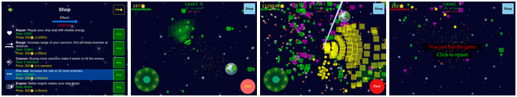](https://dvhx.github.io/game-alien-invasion/) - *Alien invasion* is a 2D bullet hell in space setting, shoot different aliens, collect credit, update ship, 13 levels, 9 aliens, 10 types of ship upgrades. [repository](https://github.com/dvhx/alien-invasion)

[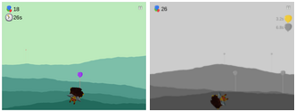](https://github.com/dvhx/game-balloon-mountains) - *Balloon mountains* is a 2D (pseudo 3D?) game where you flying over misty mountains and pop balloons, 15 different levels, 5 different balloon types/debufs. [repository](https://github.com/dvhx/game-balloon-mountains)

[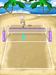](https://github.com/dvhx/game-beach-volleyball) - *Beach volleyball* is a 2D game. Swipe up (or use a mouse) to hit and direct the ball. This game is also minigame in Virtual Boyfriend. There's only 1 level and one difficulty. You play to 15 and then game starts over. [repository](https://github.com/dvhx/game-beach-volleyball)

[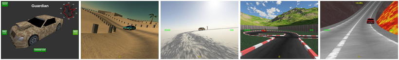](https://github.com/dvhx/game-ghost-car-challenge) - *Ghost car challenge* is a 3D WebGL game where you compete against "ghost drivers" (a replays of other players), uses tilt sensor on mobile phones (Android) or WASD on desktop. This is the only 3D game I published. It uses WebGL with no framework, when I made it, it ran 60FPS on $50 phone, and it still does.  [repository](https://github.com/dvhx/game-ghost-car-challenge)

[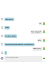](https://github.com/dvhx/game-ghost-chatbot) - *Ghost chat bot* is a really simple chat bot, it predates LLMs and unfortunately was made obsolete by them, by the numbers my most popular game with 150'000 installs. It had bidirectional speech (you talk to mic and it replays with TTS), which at that time was kinda neat, now it's common. It uses ranked document retrieval and inverted index to find answer from database of 8000 Q&A. Works fully offline. There used to be minigames but tbh their only purpose was to get IAPs so I removed them in this version and they are available as separate games. [repository](https://github.com/dvhx/game-ghost-chat-bot)

[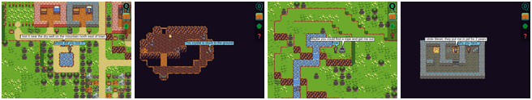](https://github.com/dvhx/game-ghost-town) - *Ghost town* is a 2D top-view pixelart game. Logical next step when you have a chatbot is to populate entire town with them. There is entire storyline and a mystery you have to solve in this game and you can only talk to NPCs. The way the quests work is that NPCs have a basic vocabulary and then quest-specific vocabulary and once the quest ends or move to next stage they switch to different vocabulary. It was lot of work but it works. [repository](https://github.com/dvhx/game-ghost-town)

[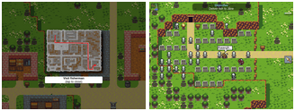](https://github.com/dvhx/game-ghost-town-2) - *Ghost town 2* is an action sequel to original ghost town, no talking in this one. I made it because I wanted to separate pixelart engine from a ghosttown so that I can spin up similar game more easily. From a quality perspective this is a downgrade, original ghosttown is much better game IMHO. [repository](https://github.com/dvhx/game-ghost-town2)

[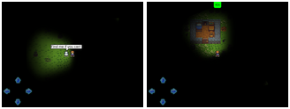](https://github.com/dvhx/game-hide-and-seek) - *Hide and seek* is 2D top-view pixelart game. I made this game when I learned about compositing operations in canvas (destination-out), I thought it would be fun and easy and it was. So basically entire scene is covered with black and then selectively flashlight light cone removes it. This was a minigame in Ghost chat bot and later in Virtual boyfriend. [repository](https://github.com/dvhx/game-hide-and-seek)

[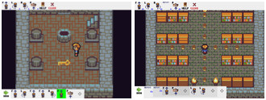](https://github.com/dvhx/game-robot-puzzle) - *Robot puzzle* is 2D top-view pixelar game. I had an idea to have character in Ghost town like word be controlled by computer instructions, like a turtle graphics, to solve some simple quests. [repository](https://github.com/dvhx/game-robot-puzzle)

[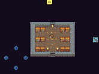](https://github.com/dvhx/game-trash-everything) - *Trash everything* is another simple idea turned into game (destroy entire level), I remember I colaborated from someone on /r/gamedev to get sounds, each tile produces different sound when it breaks, there are levels where you don't trash anything and are only allowed to trash some things.  [repository](https://github.com/dvhx/game-trash-everything)

[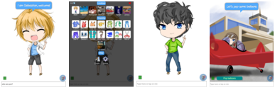](https://github.com/dvhx/game-virtual-boyfriend) - *Virtual boyfriend* is basically chatbot game with clothes. The idea was to take Ghost chat bot, add avatar as a cute boy and charge people for cute clothes via in-game currency (diamonds). It was lot of work and I don't it it broght much. Why boyfriend and not girlfriend? I thought girls are more likely to buy clothes, boys are more interested in removing clothes. This game have the most minigames, basically each new location has minigame of some sorts. [repository](https://github.com/dvhx/game-virtual-boyfriend)

[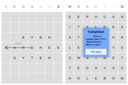](https://github.com/dvhx/game-word-puzzle) - super simple word puzzle game, just place a letter to make a word. The most dificult part of this game was to run through 100k word long corpus and remove words that I thought shouldn't be there like "aargh" and names.  [repository](https://github.com/dvhx/game-word-puzzle)

### Support

You can support development on [Patreon](https://www.patreon.com/DusanHalicky) or you can hire me via [Upwork](https://www.upwork.com/freelancers/~013b4c3d6e772fdb01)
